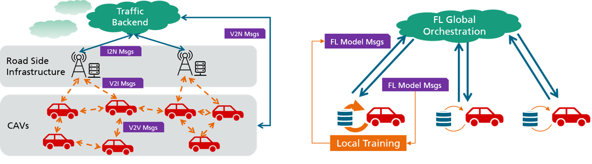

# Awesome-Federated-Learning-for-Autonomous-Driving

 

This repository is dedicated to curating a comprehensive collection of research papers that explore the implementation of federated learning in 
  - Autonomous Driving (AD), 
  - Intelligent Transportation Systems (ITS), 
  - and Connected and Automated Vehicles (CAV).

Welcome contributions from everyone in the form of additional relevant papers, as well as suggestions to enhance the repository. **Feel free to create issues in this repository or email me.** Thank you for your support and collaboration!

## Contents
- [Main](#main)
  - [Perception](#perception)
  - [Localization/SLAM](#localization)
  - [Planning](#planning)
  - [Action and Control](#action)
  - [Behavior Prediction](#behavior)
  - [Traffic Flow Prediction](#trafficflow)
  - [V2X Communication](#v2x)
  - [Electric Vehicles](#electric)
  - [Blockchain and Privacy](#blockchain)
  - [Framework](#framework)
  - [Benchmark](#benchmark)
  - [Survey](#survey)

<a name="main" />

## Main

<a name="perception" />

### Perception
+ [A Federated Learning-Based License Plate Recognition Scheme for 5G-Enabled Internet of Vehicles](https://ieeexplore.ieee.org/document/9381655) (Kong, Xiangjie et al., TII 2021)   [:book:](./citations/kong2021federated.txt)
+ [Federated Learning for Object Detection in Autonomous Vehicles](https://ieeexplore.ieee.org/document/9564384) (Jallepalli, Deepthi et al., BigDataService 2021)   [:book:](./citations/jallepalli2021federated.txt)
+ [Federated Deep Learning Meets Autonomous Vehicle Perception: Design and Verification](https://ieeexplore.ieee.org/document/9982368) (Wang, Shuai et al., IEEE Network 2022) [:octocat:](https://github.com/SIATINVS/CarlaFLCAV) [:book:](./citations/wang2022federated.txt)
+ [Efficient Federated Learning With Spike Neural Networks for Traffic Sign Recognition](https://ieeexplore.ieee.org/abstract/document/9784851) (Xie, Kan et al., TVT 2022)   [:book:](./citations/xie2022efficient.txt)
+ [FedBEVT: Federated Learning Bird's Eye View Perception Transformer in Road Traffic Systems](https://ieeexplore.ieee.org/document/10236488) (Song, Rui and Xu, Runsheng et al., TIV 2023) [:octocat:](https://github.com/rruisong/FedBEVT) [:book:](./citations/yu2019federated.txt)
+ [Federated Semi-Supervised Learning for Object Detection in Autonomous Driving](https://ieeexplore.ieee.org/document/10096290) (Fangyuan Chi et al., ICASSP 2023) [:book:](./citations/chi2023federated.txt)
+ [Federated Learning for Lidar Super Resolution on Automotive Scenes](https://ieeexplore.ieee.org/document/10167942) (Gkillas, Alexandros et al., DSP 2023) [:book:](./citations/gkillas2023federated.txt)
+ [Federated Cooperative 3D Object Detection for Autonomous Driving](https://ieeexplore.ieee.org/document/10285959) (Fangyuan Chi et al., MLSP 2023) [:book:](./citations/chi2023bfederated.txt)
+ [ADS-Lead: Lifelong Anomaly Detection in Autonomous Driving Systems](https://ieeexplore.ieee.org/document/9690769) (Han, Xingshuo et al., TITS 2023) [:book:](./citations/han2023ads.txt)

<a name="localization" />

### Localization/SLAM
+ [FedVCP: A Federated-Learning-Based Cooperative Positioning Scheme for Social Internet of Vehicles](https://ieeexplore.ieee.org/abstract/document/9378811) (Kong, Xiangjie et al., TCSS 2021)   [:book:](./citations/kong2021fedvcp.txt)
+ [FedLoc: Federated Learning Framework for Data-Driven Cooperative Localization and Location Data Processing](https://ieeexplore.ieee.org/document/9250516) (Yin, Feng et al., OJSP 2020)   [:book:](./citations/yin2020fedloc.txt)
+ [Reconfigurable Holographic Surface Aided Collaborative Wireless SLAM Using Federated Learning for Autonomous Driving](https://ieeexplore.ieee.org/document/10149400) (Zhang, Haobo et al., TIV 2023)   [:book:](./citations/zhang2023reconfigurable.txt)

<a name="planning" />

### Planning
+ [FED-UP: Federated Deep Reinforcement Learning-based UAV Path Planning against Hostile Defense System](https://ieeexplore.ieee.org/document/9964907) (Khalil, Alvi Ataur et al., CNSM 2022)   [:book:](./citations/khalil2022fedup.txt)

<a name="action" />

### Action and Control
+ [Autonomous Braking Algorithm for Rear-End Collision via Communication-Efficient Federated Learning](https://ieeexplore.ieee.org/document/9685298) (Liu, Sha et al., GLOBECOM 2021)   [:book:](./citations/liu2021autonomous.txt)

<a name="behavior" />

### Behavior Prediction
+ [Steering Angle Prediction for Autonomous Driving using Federated Learning: The Impact of Vehicle-To-Everything Communication](https://ieeexplore.ieee.org/document/9580097) (M. P. Aparna et al., ICCCNT 2021)   [:book:](./citations/aparna2021steering.txt)

<a name="trafficflow" />

### Traffic Flow Prediction
+ [Privacy-Preserving Traffic Flow Prediction: A Federated Learning Approach](https://ieeexplore.ieee.org/document/9082655) (Liu, Yi et al., JIOT 2020)   [:book:](./citations/liu2020privacy.txt)
+ [BFRT: Blockchained Federated Learning for Real-time Traffic Flow Prediction](https://ieeexplore.ieee.org/document/9082655) (Meese, Collin et al., CCGrid 2022)   [:book:](./citations/meese2022bfrt.txt)
+ [FedRSU: Federated Learning for Scene Flow Estimation on Roadside Units](https://arxiv.org/abs/2401.12862) (Fang, Shaoheng et al., arXiv 2024)   [:book:](./citations/fang2024bfedrsu.txt)

<a name="v2x" />

### V2X Communication
+ [Federated Learning for Ultra-Reliable Low-Latency V2V Communications](https://ieeexplore.ieee.org/document/8647927) (Lim, Wei Yang Bryan et al., GLOBECOM 2018)   [:book:](./citations/samarakoon2018federated.txt)
+ [Communication-Efficient Massive UAV Online Path Control: Federated Learning Meets Mean-Field Game Theory](https://ieeexplore.ieee.org/document/9169921) (Shiri, Hamid et al., TCOMM 2020)   [:book:](./citations/shiri2020communication.txt)
+ [Multiagent DDPG-Based Deep Learning for Smart Ocean Federated Learning IoT Networks](https://ieeexplore.ieee.org/document/9067847) (Kwon, Dohyun et al., JIoT 2020)   [:book:](./citations/kwon2020multiagent.txt)
+ [Distributed Federated Learning for Ultra-Reliable Low-Latency Vehicular Communications](https://ieeexplore.ieee.org/document/8917592) (Samarakoon, Sumudu et al., TCOMM 2020)   [:book:](./citations/samarakoon2020tcomm.txt)
+ [Towards Federated Learning in UAV-Enabled Internet of Vehicles: A Multi-Dimensional Contract-Matching Approach](https://ieeexplore.ieee.org/document/9354588) (Lim, Wei Yang Bryan et al., TITS 2021)   [:book:](./citations/lim2021towards.txt)
+ [Federated learning in vehicular networks](https://ieeexplore.ieee.org/document/9928621) (Elbir, Ahmet M et al., MeditCom 2022)   [:book:](./citations/elbir2022federated.txt)
+ [Federated Learning on the Road Autonomous Controller Design for Connected and Autonomous Vehicles](https://ieeexplore.ieee.org/abstract/document/9806308) (Zeng, Tengchan et al., TWC 2022)   [:book:](./citations/zeng2022federated.txt)
+ [Cybertwin-Driven Federated Learning Based Personalized Service Provision for 6G-V2X](https://ieeexplore.ieee.org/document/9645064) (Sahaya Beni Prathiba et al., TVT 2022)   [:book:](./citations/sahaya2022cybertwin.txt)
+ [A Distributed Learning Architecture for Semantic Communication in Autonomous Driving Networks for Task Offloading](https://ieeexplore.ieee.org/document/9645064) (Zheng, Guhan et al., MCOM 2023)   [:book:](./citations/zheng2023a.txt)

<a name="electric" />

### Electric Vehicles
+ [Energy Demand Prediction with Federated Learning for Electric Vehicle Networks](https://ieeexplore.ieee.org/document/9013587) (Saputra, Yuris Mulya M et al., GLOBECOM 2019)   [:book:](./citations/aputra2019energy.txt)
+ [Federated Learning Meets Contract Theory: Economic-Efficiency Framework for Electric Vehicle Networks](https://ieeexplore.ieee.org/document/9300192) (Saputra, Yuris Mulya M et al., TMC 2022)   [:book:](./citations/saputra2022federated.txt)

<a name="blockchain" />

### Blockchain and Privacy
+ [Blockchain-based federated learning for device failure detection in industrial IoT](https://ieeexplore.ieee.org/document/9233457) (Zhang, Weishan et al., JIOT 2020)   [:book:](./citations/zhang2020blockchain.txt)
+ [Federated Learning With Blockchain for Autonomous Vehicles: Analysis and Design Challenges](https://ieeexplore.ieee.org/document/9079513) (Pokhrel, Shiva Raj and Choi, Jinho, TCOMM 2020)   [:book:](./citations/pokhrel2020federated.txt)
+ [Privacy-preserved federated learning for autonomous driving](https://ieeexplore.ieee.org/document/9457207) (Li, Yijing et al., TITS 2021)   [:book:](./citations/li2021privacy.txt)
+ [Bift: A Blockchain-Based Federated Learning System for Connected and Autonomous Vehicles](https://ieeexplore.ieee.org/document/10182869) (He, Ying et al., JIOT 2022)   [:book:](./citations/he2021bift.txt)
+ [Blockchain-Enabled Federated Learning for UAV Edge Computing Network: Issues and Solutions](https://ieeexplore.ieee.org/document/9774400) (Zhu, Chaoyang et al., IEEE Access 2022)   [:book:](./citations/zhu2022blockchain.txt)
+ [Federated Vehicular Transformers and Their Federations: Privacy-Preserving Computing and Cooperation for Autonomous Driving](https://ieeexplore.ieee.org/document/9857660) (Tian, Yonglin et al., TIV 2022)   [:book:](./citations/tian2022federated.txt)
+ [Design of Federated Learning Engagement Method for Autonomous Vehicle Privacy Protection](https://ieeexplore.ieee.org/document/10001889) (Jung-Sook Kim, SCIS&ISIS 2022)   [:book:](./citations/kim2022design.txt)
+ [Emergency Vehicle Identification for Internet of Vehicles Based on Federated Learning and Homomorphic Encryption](https://ieeexplore.ieee.org/document/10166254) (Siyuan Zeng et al., DDCLS 2023)   [:book:](./citations/zeng2023emergency.txt)

<a name="framework" />

### Framework
+ [Federated Learning in Vehicular Edge Computing: A Selective Model Aggregation Approach](https://ieeexplore.ieee.org/document/8964354) (Ye, Dongdong et al., IEEE Access 2020)   [:book:](./citations/ye2020federated.txt)
+ [Real-time end-to-end federated learning: An automotive case study](https://ieeexplore.ieee.org/document/9529467) (Zhang, Hongyi et al., COMPSAC 2021)   [:book:](./citations/zhang2021real.txt)
+ [End-to-End Federated Learning for Autonomous Driving Vehicles](https://ieeexplore.ieee.org/document/9533808) (Zhang, Hongyi et al., IJCNN 2021)   [:book:](./citations/zhang2021end.txt)
+ [Federated Learning Framework Coping with Hierarchical Heterogeneity in Cooperative ITS](https://ieeexplore.ieee.org/document/9922064) (Song, Rui et al., ITSC 2022)   [:book:](./citations/song2022federated.txt)
+ [Deep Federated Learning for Autonomous Driving](https://ieeexplore.ieee.org/document/9827020) (Nguyen, Anh et al., IEEE IV 2022)   [:book:](./citations/nguyen2022deep.txt)
+ [GOF-TTE: Generative Online Federated Learning Framework for Travel Time Estimation](https://ieeexplore.ieee.org/document/9829726) (Zhang, Zhiwen et al., JIoT 2022)   [:book:](./citations/zhang2022goftte.txt)
+ [Federated Transfer Reinforcement Learning for Autonomous Driving](https://link.springer.com/chapter/10.1007/978-3-031-11748-0_15) (Liang, Xinle et al., Federated and Transfer Learning 2022)   [:book:](./citations/liang2023federated.txt)
+ [A Dispersed Federated Learning Framework for 6G-Enabled Autonomous Driving Cars](https://ieeexplore.ieee.org/document/9831041) (Khan, Latif U. et al., TNSE 2022)   [:book:](./citations/khan2022a.txt)
+ [Clustered Vehicular Federated Learning: Process and Optimization](https://ieeexplore.ieee.org/document/9716076) (Taïk, Afaf et al., TNSE 2022)   [:book:](./citations/taik2022clustered.txt)
+ [Communication-Efficient Federated Edge Learning via Optimal Probabilistic Device Scheduling](https://ieeexplore.ieee.org/document/9760232) (Zhang, Maojun et al., TWC 2022)   [:book:](./citations/zhang2022communication.txt)
+ [Complex Network Cognition-based Federated Reinforcement Learning for End-to-end Urban Autonomous Driving](https://ieeexplore.ieee.org/document/10316275) (Cai, Yingfeng et al., TTE 2023)   [:book:](./citations/cai2023complex.txt)
+ [An Incentive Mechanism of Incorporating Supervision Game for Federated Learning in Autonomous Driving](https://ieeexplore.ieee.org/document/10205502) (Fu, Yuchuan et al., TITS 2023)   [:book:](./citations/fu2023an.txt)

<a name="benchmark" />

### Benchmark
+ [FedDrive: Generalizing Federated Learning to Semantic Segmentation in Autonomous Driving](https://ieeexplore.ieee.org/abstract/document/9981098/) (Fantauzzo, Lidia et al., IROS 2022) [:octocat:](https://feddrive.github.io) [:book:](./citations/fantauzzo2022feddrive.txt)

<a name="survey" />

### Survey
+ [Federated Learning for Vehicular Internet of Things: Recent Advances and Open Issues](https://ieeexplore.ieee.org/document/9086790) (Du, Zhaoyang et al., OJCS 2020)   [:book:](./citations/du2020federated.txt)

